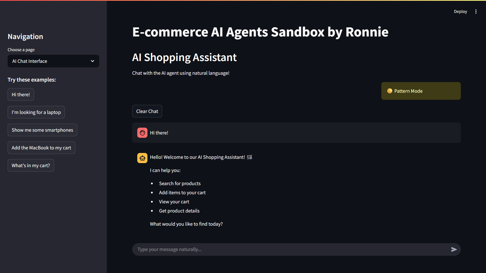
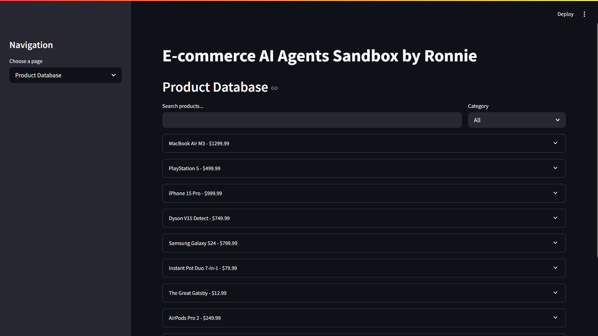

# 🛒 E-commerce AI Agents Sandbox

An interactive e-commerce platform powered by AI agents using **Ollama**, **LangChain**, and **Streamlit**. This application demonstrates how AI agents can handle natural language conversations for shopping tasks like product search, cart management, and customer assistance.


## 🎯 Features

- **Natural Language Chat Interface** - Talk to the AI assistant using everyday language
- **Intelligent Product Search** - Find products using descriptions, categories, or keywords
- **Smart Cart Management** - Add items to cart through conversation
- **Product Database** - Browse and manage a comprehensive product catalog
- **Wishlist Functionality** - Save products for later
- **AI Agent Testing** - Test different conversation scenarios
- **System Analytics** - Monitor interactions and database statistics
- **Hybrid AI System** - Works with or without Ollama (fallback to pattern matching)

## 🏗️ System Architecture

### Core Components

1. **AI Agent Layer** - Powered by Ollama LLM with LangChain framework
2. **Database Layer** - SQLite in-memory database for products and user data
3. **UI Layer** - Streamlit web interface with multiple pages
4. **Tools System** - Modular tools for different e-commerce operations

### How It Works

```
User Input → AI Agent → Intent Analysis → Tool Selection → Database Operation → Natural Response
```

The system uses **intent recognition** to understand user requests and automatically selects the appropriate tools to fulfill them.

## 📋 Prerequisites

- Python 3.8 or higher
- Ollama installed and running (optional - system has fallback mode)
- 8GB+ RAM recommended
- Internet connection for initial setup

## 🚀 Installation

### 1. Clone the Repository

```bash
git clone https://github.com/Kakunguwo/ecommerce-ai-agents.git
cd ecommerce-ai-agents
```

### 2. Create Virtual Environment

```bash
python -m venv venv

# On Windows
venv\Scripts\activate

# On macOS/Linux
source venv/bin/activate
```

### 3. Install Dependencies

```bash
pip install -r requirements.txt
```

### 4. Install and Setup Ollama

1. Download Ollama from [https://ollama.com](https://ollama.com)
2. Run the installer
3. Open Command Prompt and run:
```bash
ollama pull gemma3:1b
```


### 5. Verify Ollama Installation

```bash
# Start Ollama server (if not already running)
ollama serve

# In another terminal, test the model
ollama run gemma3:1b "Hello, how are you?"
```

### 6. Run the Application

```bash
streamlit run app.py
```

The application will open in your browser at `http://localhost:8501`

## 📱 Interface Screenshots

### Main Chat Interface
**

### Product Database
**


## 🎮 Usage Guide

### Basic Conversations

The AI assistant understands natural language. Try these examples:

```
"Hi there!"
"I'm looking for a laptop"
"Show me some smartphones"
"Add the MacBook to my cart"
"What's in my cart?"
"Tell me more about product 1"
```

### Navigation

- **AI Chat Interface** - Main conversation with the AI assistant
- **Product Database** - Browse all products with search and filters
- **Cart & Wishlist** - View and manage your selected items
- **Agent Testing** - Test different AI scenarios
- **System Logs** - View analytics and interaction history

### AI Features

1. **Intent Recognition** - Understands what you want to do
2. **Entity Extraction** - Identifies product names, IDs, quantities
3. **Context Awareness** - Remembers conversation context
4. **Natural Responses** - Generates human-like responses
5. **Error Handling** - Gracefully handles unclear requests

## 🔧 Configuration

### Changing the AI Model

Edit `app.py` and modify the model name:

```python
@st.cache_resource
def initialize_llm():
    return OllamaLLM(model="your-preferred-model")  # Change this
```

### Ollama Models used

- `gemma3:1b` (lightweight, fast)


### Database Configuration

The app uses SQLite in-memory database by default. To use persistent storage, modify:

```python
def __init__(self):
    self.conn = sqlite3.connect('ecommerce.db', check_same_thread=False)  # Persistent DB
```

## 🛠️ Technical Details

### Tech Stack

- **Frontend**: Streamlit (Python web framework)
- **AI Framework**: LangChain for agent orchestration
- **LLM**: Ollama with Gemma 3 1B model
- **Database**: SQLite for data persistence
- **Language**: Python 3.8+

### Key Libraries

- **streamlit**: Web interface and user interaction
- **langchain**: AI agent framework and tools
- **langchain-ollama**: Ollama integration for LangChain
- **pandas**: Data manipulation and display
- **sqlite3**: Database operations

### Architecture Patterns

- **Agent Pattern**: AI agents with tools and memory
- **Repository Pattern**: Database abstraction layer
- **Observer Pattern**: Streamlit reactive updates
- **Strategy Pattern**: Multiple response strategies (AI vs Pattern)

## 📚 Documentation Links

### Core Technologies
- **Streamlit Documentation**: [https://docs.streamlit.io/](https://docs.streamlit.io/)
- **LangChain Documentation**: [https://python.langchain.com/](https://python.langchain.com/)
- **Ollama Documentation**: [https://ollama.com/docs](https://ollama.com/docs)

### AI and ML Resources
- **LangChain Agents Guide**: [https://python.langchain.com/docs/modules/agents/](https://python.langchain.com/docs/modules/agents/)
- **Ollama Model Library**: [https://ollama.com/library](https://ollama.ai/library)
- **Streamlit Chat Elements**: [https://docs.streamlit.io/library/api-reference/chat](https://docs.streamlit.io/library/api-reference/chat)

### Development Resources
- **LangChain Tools**: [https://python.langchain.com/docs/modules/agents/tools/](https://python.langchain.com/docs/modules/agents/tools/)
- **Streamlit Components**: [https://docs.streamlit.io/library/components](https://docs.streamlit.io/library/components)

## 🔍 Troubleshooting

### Common Issues

#### 1. Ollama Connection Error
```
Error: Ollama not available - using pattern matching fallback
```
**Solution**: 
- Ensure Ollama is installed and running
- Check if the model is pulled: `ollama list`
- Restart Ollama service: `ollama serve`

#### 2. Memory Issues
```
Error: Out of memory
```
**Solution**:
- Use a smaller model like `gemma3:1b`
- Close other applications
- Increase system RAM

#### 3. Port Already in Use
```
Error: Port 8501 is already in use
```
**Solution**:
```bash
streamlit run app.py --server.port 8502
```

#### 4. Module Import Errors
```
ModuleNotFoundError: No module named 'langchain_ollama'
```
**Solution**:
```bash
pip install --upgrade langchain langchain-ollama
```

### Performance Tips

- Use `gemma3:1b` for faster responses
- Clear chat history regularly
- Monitor system resources
- Use caching for frequently accessed data

## 🤝 Contributing

1. Fork the repository
2. Create a feature branch (`git checkout -b feature/amazing-feature`)
3. Commit your changes (`git commit -m 'Add amazing feature'`)
4. Push to the branch (`git push origin feature/amazing-feature`)
5. Open a Pull Request

### Development Setup

```bash
# Install development dependencies
pip install -r requirements-dev.txt

```

## 📄 License

This project is licensed under the MIT License - see the LICENSE file for details.

## 👤 Author

**Ronnie Kakunguwo**


## 🙏 Acknowledgments

- **Ollama Team** for the amazing local LLM runtime
- **LangChain** for the powerful agent framework
- **Streamlit** for the intuitive web framework
- **Google** for the Gemma model family

## 📈 Roadmap

- [ ] **Multi-user Support** - User authentication and sessions
- [ ] **Payment Integration** - Checkout and payment processing
- [ ] **Recommendation Engine** - AI-powered product recommendations
- [ ] **Voice Interface** - Speech-to-text integration
- [ ] **Multi-language Support** - International language support
- [ ] **Advanced Analytics** - User behavior tracking
- [ ] **API Integration** - External e-commerce APIs

## 🆘 Support

If you encounter any issues or have questions:

1. Check the [Troubleshooting](#🔍-troubleshooting) section
2. Search existing [GitHub Issues](https://github.com/Kakunguwo/ecommerce-ai-agents.git/issues)
3. Create a new issue with detailed information


---

⭐ **Star this repository if you found it helpful!** ⭐

*Last updated: 31 July 2025*